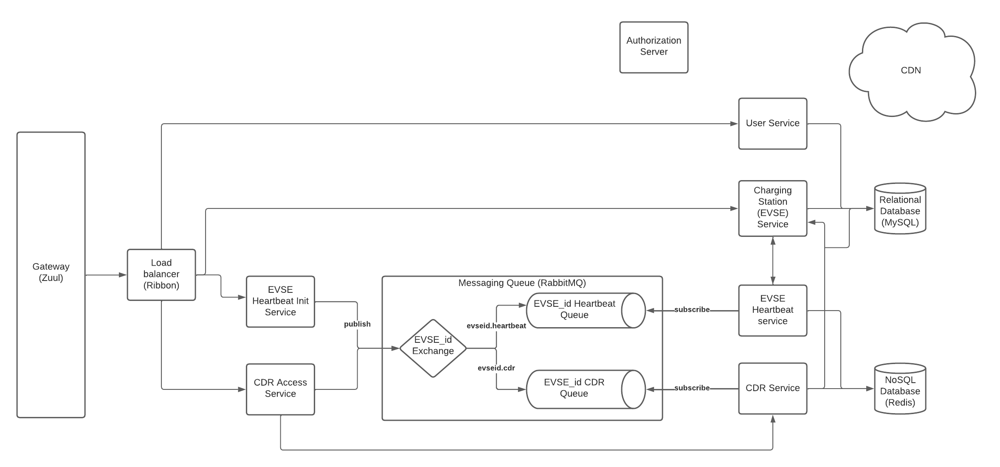

# Challenge 2

## Functional requirements

1) User can register in CSMS as EV Customer and can register cars that he/she owns.
2) User can only fetch the information regarding the state of Charging Stations nearby
3) User can get authenticated and authorized from the Charging Station
4) User can choose the car he/she wants to charge.
5) User can start charging for a particular car he/she owns
6) Charging Station sends heartbeats every 3 mins to the system. It has the states below at each time:
    - Available
    - Unavailable
    - Charging
7) Charging station begins to charge
    - The state of the charging station will change from Available to Charging.
    - heartbeats would be sent to the server rapidly. A ping pong needs to be implemented through websocket.
    - A Charge Detail Record would be created
    - The charging starts
        - Charging Station's state would become Charging
        - Charge Detail Record's state would become Started
    - The charging ends
        - Charging Station's state would become Available
        - Charge Detail Record's state would become Finished 
    - If the Charging Station or the CSMS become Unavailable
        - if during the charge then they have to get in sync while both Available
        - if Charging Station is Unavailable (not during charge), CSMS would change its state to UNAVAILABLE

    

## Scale
1) Around 6.75 million cars around the world
2) There are 96,536 charging stations around the world
3) Assume 24 cars get charged by each Charging Station
4) 24 * 100,000 = 2400000 charges per day
5) 2400000 * 365 = 876000000 charges per year (Charge Detail Records per year)

## Non-Functional-Requirements
1) Security: 
    - The system must be secure. 
    - Charging Stations must be authorized.
2) Reliability:
    - The system must be reliable
    - It has to work correctly during the charge and if not, the state must be stored and recovered when system becomes available
3) Maintainable:
    - The system must be maintainable
4) Scalability:
    - The scale of the system is not very extensive
    - However, in the near future, the scale can steadily expand
    - A normal relational database can be used (queries on tables with couple of million records can be easily done)
    - However for the Charge Detail Record table, a simple sharding can be done
    - It is not advised to use distributed NoSQL (like Cassandra) for Charge Detail Records, since there are many updates needed during each charge and it can be operation heavy on a NoSQL database.  
5) Performance:
    - Since the scale of the system is managable, performance would not be a big of an issue if microservice structure is used
    

